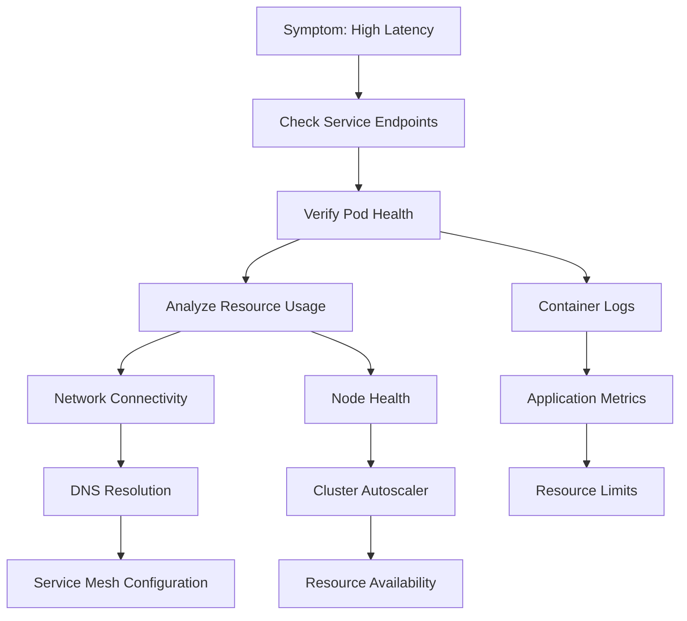

# Kubernetes Troubleshooting Handbook: Comprehensive Guide to Debugging and Problem Resolution

## Table of Contents

1. [Introduction](#introduction)
2. [Systematic Troubleshooting Methodology](#systematic-troubleshooting-methodology)
3. [Essential Troubleshooting Tools](#essential-troubleshooting-tools)
4. [Common Kubernetes Issues and Solutions](#common-kubernetes-issues-and-solutions)
5. [Pod Troubleshooting](#pod-troubleshooting)
6. [Networking and Service Discovery Issues](#networking-and-service-discovery-issues)
7. [Storage and Persistent Volume Problems](#storage-and-persistent-volume-problems)
8. [Security and RBAC Troubleshooting](#security-and-rbac-troubleshooting)
9. [Performance Bottleneck Analysis](#performance-bottleneck-analysis)
10. [Multi-Cluster and GitOps Troubleshooting](#multi-cluster-and-gitops-troubleshooting)
11. [Service Mesh Debugging](#service-mesh-debugging)
12. [Cloud Provider Specific Issues](#cloud-provider-specific-issues)
13. [AI-Assisted Troubleshooting](#ai-assisted-troubleshooting)
14. [Incident Response and Post-Mortem](#incident-response-and-post-mortem)
15. [Disaster Recovery Procedures](#disaster-recovery-procedures)
16. [Troubleshooting Automation](#troubleshooting-automation)

---

## Introduction

Kubernetes troubleshooting has evolved significantly with the platform's maturity. In 2025, modern troubleshooting combines traditional debugging techniques with AI-assisted analysis, observability-driven investigation, and automated remediation. This handbook provides comprehensive guidance for diagnosing and resolving issues across all aspects of Kubernetes environments.

### Current State of Kubernetes Operations (2025)

- **Incident Complexity**: Nearly 80% of production outages trace back to system changes
- **AI Integration**: AI SRE systems can autonomously investigate up to 80% of incidents
- **Context Switching Overhead**: Traditional coordination tax averages 10-15 minutes per incident
- **Observability-First**: Modern approaches prioritize events-first investigation methodology

### Business Impact

- **Mean Time To Resolution (MTTR)**: Advanced platforms report 40-70% reduction
- **Incident Frequency**: Proper troubleshooting processes reduce recurring issues by 60%
- **Operational Efficiency**: Automated root cause analysis eliminates manual investigation overhead
- **Cost Impact**: Faster resolution reduces downtime costs and operational overhead

---

## Systematic Troubleshooting Methodology

### Events-First Investigation (2025 Standard)

Modern troubleshooting methodologies prioritize recent events and changes as primary investigation vectors:

#### 1. Change Detection Timeline
```bash
# Check recent changes across the cluster
kubectl get events --sort-by='.lastTimestamp' --all-namespaces | head -20

# Identify deployment changes
kubectl rollout history deployment --all-namespaces

# Check for configuration changes
kubectl get configmaps,secrets --all-namespaces -o custom-columns=NAME:.metadata.name,NAMESPACE:.metadata.namespace,AGE:.metadata.creationTimestamp --sort-by='.metadata.creationTimestamp'
```

#### 2. Correlation Analysis Framework
```bash
#!/bin/bash
# correlation-analysis.sh - Correlate events with symptoms

SYMPTOM_TIME=${1:-"5m"}
NAMESPACE=${2:-"--all-namespaces"}

echo "=== Correlation Analysis for Last $SYMPTOM_TIME ==="

# Get events in time window
echo "1. Recent Events:"
kubectl get events $NAMESPACE --sort-by='.lastTimestamp' | \
grep -E "$(date -d "$SYMPTOM_TIME ago" +%Y-%m-%d)" || echo "No recent events"

# Check for resource changes
echo "2. Recent Resource Changes:"
kubectl get pods,deployments,services $NAMESPACE -o custom-columns=NAME:.metadata.name,NAMESPACE:.metadata.namespace,AGE:.metadata.creationTimestamp | \
grep -E "$(date -d "$SYMPTOM_TIME ago" +%Y-%m-%d)" || echo "No recent changes"

# Analyze error patterns
echo "3. Error Patterns:"
kubectl get events $NAMESPACE --field-selector type=Warning | \
grep -E "$(date -d "$SYMPTOM_TIME ago" +%Y-%m-%d)" || echo "No warnings"
```

### Structured Investigation Framework

#### Four-Stage Process

**Stage 1: Preparation and Context**
```yaml
Investigation Checklist:
  - [ ] Gather incident description and symptoms
  - [ ] Identify affected services and timeframe
  - [ ] Collect monitoring dashboard URLs
  - [ ] Verify access to cluster and monitoring tools
  - [ ] Assemble response team if needed
```

**Stage 2: Detection and Analysis**
```bash
# Quick cluster health check
kubectl cluster-info
kubectl get nodes -o wide
kubectl get pods --all-namespaces | grep -v Running | grep -v Completed

# Component status verification
kubectl get componentstatuses
kubectl get apiservices | grep -v True
```

**Stage 3: Containment and Investigation**
```bash
# Isolate affected resources if needed
kubectl cordon <problematic-node>
kubectl scale deployment <problematic-deployment> --replicas=0 -n <namespace>

# Create investigation namespace for debugging
kubectl create namespace debug-$(date +%Y%m%d-%H%M%S)
```

**Stage 4: Recovery and Learning**
- Document root cause and resolution steps
- Update runbooks and monitoring
- Implement preventive measures
- Conduct post-incident review

### Investigation Graph Methodology

Modern troubleshooting uses investigation graphs to visualize relationships:



---

## Essential Troubleshooting Tools

### kubectl Advanced Commands

#### Essential Debug Commands
```bash
# Enhanced pod inspection
kubectl get pod <pod-name> -n <namespace> -o yaml
kubectl describe pod <pod-name> -n <namespace>
kubectl logs <pod-name> -n <namespace> --previous --tail=100

# Debug with ephemeral containers (Kubernetes 1.25+)
kubectl debug <pod-name> -it --image=busybox --target=<container-name>
kubectl debug <pod-name> -it --image=nicolaka/netshoot --share-processes --copy-to=debug-copy

# Node-level debugging
kubectl debug node/<node-name> -it --image=busybox
kubectl get events --field-selector involvedObject.name=<node-name>
```

#### Resource Analysis Commands
```bash
# Resource utilization analysis
kubectl top nodes
kubectl top pods --all-namespaces --sort-by=cpu
kubectl top pods --all-namespaces --sort-by=memory

# Capacity and allocation analysis
kubectl describe nodes | grep -A 7 "Allocated resources"
kubectl get nodes -o custom-columns=NAME:.metadata.name,CPU:.status.allocatable.cpu,MEMORY:.status.allocatable.memory

# PDB and disruption analysis
kubectl get pdb --all-namespaces
kubectl describe pdb <pdb-name> -n <namespace>
```

#### Advanced Filtering and Queries
```bash
# Complex field selectors
kubectl get events --field-selector reason=Failed,involvedObject.kind=Pod
kubectl get pods --field-selector status.phase=Pending --all-namespaces

# JSON path queries for complex data extraction
kubectl get pods -o jsonpath='{range .items[*]}{.metadata.name}{"\t"}{.status.phase}{"\t"}{.spec.nodeName}{"\n"}{end}'

# Custom resource analysis
kubectl get crd -o custom-columns=NAME:.metadata.name,VERSION:.spec.versions[0].name,SCOPE:.spec.scope
```

### Container Runtime Debugging

#### containerd (CRI-O similar patterns)
```bash
# Configure crictl
export RUNTIME_ENDPOINT=unix:///run/containerd/containerd.sock
export IMAGE_ENDPOINT=unix:///run/containerd/containerd.sock

# Essential crictl commands
crictl ps | head -10               # List running containers
crictl pods | head -10             # List pods
crictl images | head -10           # List images

# Deep container inspection
crictl inspect <container-id>      # Detailed container information
crictl logs <container-id> --tail=50  # Container logs
crictl exec -it <container-id> sh     # Execute into container

# Container lifecycle analysis
crictl ps -a | grep Exited         # Find exited containers
crictl stats                       # Runtime resource usage
crictl info                        # Runtime information
```

#### Runtime Configuration Debug
```bash
# Check runtime configuration
cat /etc/containerd/config.toml
cat /etc/crio/crio.conf

# Verify runtime endpoints
ls -la /run/containerd/
ls -la /var/run/crio/

# Runtime service status
systemctl status containerd
systemctl status crio
journalctl -u containerd -f
```

### Network Troubleshooting Tools

#### Advanced Network Debugging
```bash
# Install network troubleshooting tools
kubectl run netshoot --image=nicolaka/netshoot -it --rm -- bash

# Within netshoot container:
# DNS testing
nslookup kubernetes.default.svc.cluster.local
dig +short kubernetes.default.svc.cluster.local

# Connectivity testing
nc -zv <service-name>.<namespace>.svc.cluster.local <port>
telnet <service-ip> <port>

# Network interface analysis
ip addr show
ip route show
ss -tuln

# Packet capture
tcpdump -i any -n host <target-ip>
```

#### Cilium CLI (for eBPF-based networks)
```bash
# Install Cilium CLI
CILIUM_CLI_VERSION=$(curl -s https://raw.githubusercontent.com/cilium/cilium-cli/main/stable.txt)
curl -L --fail --remote-name-all https://github.com/cilium/cilium-cli/releases/download/${CILIUM_CLI_VERSION}/cilium-linux-amd64.tar.gz{,.sha256sum}
sudo tar xzvfC cilium-linux-amd64.tar.gz /usr/local/bin

# Network connectivity testing
cilium connectivity test
cilium status
cilium map list

# Network policy debugging
cilium monitor --type=drop
cilium endpoint list
cilium policy get
```

#### Traditional Network Tools
```bash
# ksniff for packet capture
kubectl ksniff <pod-name> -n <namespace> -o capture.pcap
kubectl ksniff <pod-name> -n <namespace> -f "port 80" -o http-capture.pcap

# Network policy testing
kubectl run test-pod --image=busybox -it --rm -- sh
# From within pod, test connectivity to various services
```

### Log Analysis and Aggregation

#### Fluent Bit Debugging
```bash
# Check Fluent Bit status
kubectl get pods -n logging -l app=fluent-bit
kubectl logs -n logging -l app=fluent-bit --tail=100

# Fluent Bit configuration verification
kubectl get configmap -n logging fluent-bit-config -o yaml

# Test log parsing
kubectl exec -n logging <fluent-bit-pod> -- fluent-bit --dry-run -c /fluent-bit/etc/fluent-bit.conf
```

#### ELK/Loki Log Analysis
```bash
# Loki log queries
logcli query '{namespace="default"}' --since=1h --limit=100
logcli query '{namespace="default"} |= "error"' --since=30m

# Elasticsearch queries
curl -X GET "elasticsearch:9200/_search" -H 'Content-Type: application/json' -d'
{
  "query": {
    "bool": {
      "must": [
        {"term": {"kubernetes.namespace": "default"}},
        {"range": {"@timestamp": {"gte": "now-1h"}}}
      ]
    }
  }
}'
```

---

## Common Kubernetes Issues and Solutions

### Pod Scheduling Issues

#### Problem: Pods Stuck in Pending State
```bash
# Investigation steps
kubectl describe pod <pending-pod> -n <namespace>
kubectl get events --field-selector involvedObject.name=<pending-pod> -n <namespace>

# Common causes and solutions:

# 1. Insufficient resources
kubectl top nodes
kubectl describe nodes | grep -A 10 "Allocated resources"

# Solution: Add nodes or adjust resource requests
kubectl patch deployment <deployment> -p='{"spec":{"template":{"spec":{"containers":[{"name":"<container>","resources":{"requests":{"cpu":"100m","memory":"128Mi"}}}]}}}}'

# 2. Node affinity/anti-affinity issues
kubectl get nodes --show-labels
kubectl get pod <pod-name> -o yaml | grep -A 10 affinity

# Solution: Adjust affinity rules or add appropriate node labels
kubectl label nodes <node-name> environment=production

# 3. Taints and tolerations
kubectl describe nodes | grep -A 5 Taints
kubectl get pod <pod-name> -o yaml | grep -A 5 tolerations

# Solution: Add tolerations or remove taints
kubectl patch deployment <deployment> -p='{"spec":{"template":{"spec":{"tolerations":[{"key":"node-role.kubernetes.io/master","operator":"Exists","effect":"NoSchedule"}]}}}}'
```

#### Problem: Pod Eviction Issues
```bash
# Check for resource pressure
kubectl describe nodes | grep -B 5 -A 15 "Conditions"
kubectl get events --field-selector reason=Evicted --all-namespaces

# Memory pressure investigation
kubectl top pods --all-namespaces --sort-by=memory | head -20
kubectl describe pod <evicted-pod> -n <namespace>

# Disk pressure investigation
kubectl describe nodes | grep -A 10 "disk pressure"
df -h # On affected nodes
```

### Image Pull Problems

#### Problem: ImagePullBackOff or ErrImagePull
```bash
# Detailed investigation
kubectl describe pod <pod-name> -n <namespace>
kubectl get events --field-selector involvedObject.name=<pod-name>

# Check image availability
crictl images | grep <image-name>
docker pull <image-name>  # If using Docker

# Registry authentication issues
kubectl get secrets -n <namespace> | grep regcred
kubectl describe secret <registry-secret> -n <namespace>

# Solution examples:

# 1. Create registry secret
kubectl create secret docker-registry regcred \
  --docker-server=<registry-server> \
  --docker-username=<username> \
  --docker-password=<password> \
  --docker-email=<email> \
  -n <namespace>

# 2. Add imagePullSecrets to pod spec
kubectl patch deployment <deployment> -p='{"spec":{"template":{"spec":{"imagePullSecrets":[{"name":"regcred"}]}}}}'

# 3. Fix image tag issues
kubectl set image deployment/<deployment> <container>=<new-image> -n <namespace>
```

### Container Startup Failures

#### Problem: CrashLoopBackOff
```bash
# Investigation process
kubectl logs <pod-name> -n <namespace> --previous
kubectl logs <pod-name> -n <namespace> -c <container-name> --tail=100
kubectl describe pod <pod-name> -n <namespace>

# Check for common causes:

# 1. Resource limits too low
kubectl describe pod <pod-name> -n <namespace> | grep -A 10 Limits
kubectl top pod <pod-name> -n <namespace> --containers

# Solution: Increase resource limits
kubectl patch deployment <deployment> -p='{"spec":{"template":{"spec":{"containers":[{"name":"<container>","resources":{"limits":{"cpu":"500m","memory":"512Mi"}}}]}}}}'

# 2. Liveness probe failing
kubectl describe pod <pod-name> -n <namespace> | grep -A 5 Liveness

# Solution: Adjust probe configuration
kubectl patch deployment <deployment> -p='{"spec":{"template":{"spec":{"containers":[{"name":"<container>","livenessProbe":{"initialDelaySeconds":30,"periodSeconds":10}}]}}}}'

# 3. Missing dependencies
kubectl get configmaps,secrets -n <namespace>
kubectl describe deployment <deployment> -n <namespace> | grep -A 10 Env
```

### Multi-Container Pod Issues

#### Problem: Init Container Failures
```bash
# Check init container status
kubectl describe pod <pod-name> -n <namespace>
kubectl logs <pod-name> -n <namespace> -c <init-container-name>

# Debug init container dependencies
kubectl get services,endpoints -n <namespace>
kubectl run debug --image=busybox -it --rm -- nslookup <dependency-service>

# Solution patterns:

# 1. Fix service discovery
kubectl get endpoints <service-name> -n <namespace>
kubectl describe service <service-name> -n <namespace>

# 2. Adjust init container timeout
kubectl patch deployment <deployment> -p='{"spec":{"template":{"spec":{"initContainers":[{"name":"<init-container>","activeDeadlineSeconds":300}]}}}}'
```

#### Problem: Sidecar Communication Issues
```bash
# Check sidecar container logs
kubectl logs <pod-name> -n <namespace> -c <sidecar-container>
kubectl logs <pod-name> -n <namespace> -c <main-container>

# Network debugging between containers
kubectl exec -it <pod-name> -n <namespace> -c <main-container> -- netstat -tuln
kubectl exec -it <pod-name> -n <namespace> -c <main-container> -- nc -zv localhost <port>

# Volume mount issues
kubectl describe pod <pod-name> -n <namespace> | grep -A 20 Volumes
kubectl exec -it <pod-name> -n <namespace> -c <container> -- ls -la /shared/path
```

---

## Networking and Service Discovery Issues

### DNS Resolution Problems

#### Problem: Service Discovery Failures
```bash
# DNS debugging workflow
kubectl run dnsutils --image=tutum/dnsutils -it --rm -- bash

# Within dnsutils pod:
nslookup kubernetes.default
nslookup <service-name>.<namespace>.svc.cluster.local
dig +short <service-name>.<namespace>.svc.cluster.local

# Check CoreDNS health
kubectl get pods -n kube-system | grep coredns
kubectl logs -n kube-system -l k8s-app=kube-dns --tail=50

# CoreDNS configuration
kubectl get configmap -n kube-system coredns -o yaml
kubectl describe configmap -n kube-system coredns
```

#### Problem: DNS Policy Issues
```bash
# Check pod DNS configuration
kubectl get pod <pod-name> -n <namespace> -o yaml | grep -A 10 dnsPolicy
kubectl describe pod <pod-name> -n <namespace> | grep DNS

# Test different DNS policies
kubectl run dns-test --image=busybox --restart=Never --rm -it \
  --overrides='{"spec":{"dnsPolicy":"ClusterFirst"}}' \
  -- nslookup kubernetes.default

# Debug custom DNS configuration
kubectl get pod <pod-name> -o yaml | grep -A 15 dnsConfig
```

### Service Endpoint Issues

#### Problem: Service Has No Endpoints
```bash
# Service and endpoint investigation
kubectl get service <service-name> -n <namespace> -o yaml
kubectl get endpoints <service-name> -n <namespace>
kubectl describe service <service-name> -n <namespace>

# Check selector matching
kubectl get pods -n <namespace> --show-labels
kubectl get service <service-name> -n <namespace> -o yaml | grep -A 5 selector

# Verify pod readiness
kubectl get pods -n <namespace> -l <selector-labels>
kubectl describe pod <pod-name> -n <namespace> | grep -A 5 "Ready:"

# Fix selector mismatches
kubectl patch service <service-name> -n <namespace> -p='{"spec":{"selector":{"app":"<correct-app-label>"}}}'
```

#### Problem: Load Balancer Not Working
```bash
# Ingress controller debugging
kubectl get ingress -n <namespace>
kubectl describe ingress <ingress-name> -n <namespace>
kubectl get services -n ingress-nginx

# Check ingress controller logs
kubectl logs -n ingress-nginx -l app.kubernetes.io/name=ingress-nginx --tail=100

# Verify backend service configuration
kubectl get service <backend-service> -n <namespace>
curl -H "Host: <hostname>" http://<ingress-controller-ip>/<path>

# Debug annotations
kubectl get ingress <ingress-name> -o yaml | grep -A 10 annotations
```

### Network Policy Debugging

#### Problem: Network Policy Blocking Traffic
```bash
# Check network policies
kubectl get networkpolicy -n <namespace>
kubectl describe networkpolicy <policy-name> -n <namespace>

# Test connectivity with and without policies
kubectl run test-pod --image=busybox -it --rm -- sh
# Within pod: nc -zv <target-service> <port>

# Cilium-specific debugging (if using Cilium)
cilium monitor --type=drop
cilium endpoint list
cilium policy get <policy-id>

# Debug policy selectors
kubectl get pods -n <namespace> --show-labels
kubectl describe networkpolicy <policy-name> -n <namespace> | grep -A 10 Selectors
```

### Service Mesh Issues

#### Problem: Istio Sidecar Injection Issues
```bash
# Check sidecar injection configuration
kubectl get namespace <namespace> -o yaml | grep istio-injection
kubectl describe mutatingwebhookconfiguration istio-sidecar-injector

# Verify sidecar presence
kubectl get pod <pod-name> -n <namespace> -o jsonpath='{.spec.containers[*].name}'
kubectl logs <pod-name> -n <namespace> -c istio-proxy

# Debug injection policies
kubectl get pods -n <namespace> -o jsonpath='{range .items[*]}{.metadata.name}{"\t"}{.metadata.annotations.sidecar\.istio\.io/status}{"\n"}{end}'

# Manual sidecar injection
istioctl kube-inject -f deployment.yaml | kubectl apply -f -
```

---

## Storage and Persistent Volume Problems

### Persistent Volume Claim Issues

#### Problem: PVC Stuck in Pending State
```bash
# PVC investigation
kubectl describe pvc <pvc-name> -n <namespace>
kubectl get events --field-selector involvedObject.name=<pvc-name> -n <namespace>

# Check storage class
kubectl get storageclass
kubectl describe storageclass <storage-class-name>

# Verify available storage
kubectl get pv
kubectl describe nodes | grep -A 10 "Allocated resources"

# Common solutions:

# 1. Fix storage class issues
kubectl patch pvc <pvc-name> -n <namespace> -p='{"spec":{"storageClassName":"<correct-storage-class>"}}'

# 2. Create storage class if missing
cat <<EOF | kubectl apply -f -
apiVersion: storage.k8s.io/v1
kind: StorageClass
metadata:
  name: fast-ssd
provisioner: kubernetes.io/aws-ebs
parameters:
  type: gp3
  iops: "3000"
  throughput: "125"
allowVolumeExpansion: true
EOF
```

#### Problem: Volume Mount Failures
```bash
# Check mount status
kubectl describe pod <pod-name> -n <namespace> | grep -A 15 Volumes
kubectl logs <pod-name> -n <namespace> | grep -i mount

# Verify PV status
kubectl get pv
kubectl describe pv <pv-name>

# Node-level debugging
kubectl debug node/<node-name> -it --image=busybox
# Within debug container: mount | grep <volume-path>

# Check CSI driver issues
kubectl get pods -n kube-system | grep csi
kubectl logs -n kube-system -l app=csi-driver --tail=50

# SELinux context issues (if applicable)
kubectl exec -it <pod-name> -n <namespace> -- ls -laZ <mount-path>
```

### Storage Performance Issues

#### Problem: High I/O Latency
```bash
# Storage performance analysis
kubectl exec -it <pod-name> -n <namespace> -- iostat -x 1
kubectl exec -it <pod-name> -n <namespace> -- iotop

# Check storage class performance tier
kubectl describe storageclass <storage-class> | grep parameters

# Test storage performance
kubectl run storage-test --image=busybox -it --rm \
  --overrides='{"spec":{"containers":[{"name":"storage-test","image":"busybox","volumeMounts":[{"name":"test-vol","mountPath":"/data"}]}],"volumes":[{"name":"test-vol","persistentVolumeClaim":{"claimName":"<pvc-name>"}}]}}' \
  -- sh

# Within container:
dd if=/dev/zero of=/data/test.file bs=1M count=100 oflag=direct
```

#### Problem: Storage Quota Exceeded
```bash
# Check resource quotas
kubectl get resourcequota -n <namespace>
kubectl describe resourcequota <quota-name> -n <namespace>

# Analyze storage usage
kubectl get pvc -n <namespace> --sort-by=.spec.resources.requests.storage
kubectl exec -it <pod-name> -n <namespace> -- df -h

# Solution: Increase quota or clean up
kubectl patch resourcequota <quota-name> -n <namespace> -p='{"spec":{"hard":{"requests.storage":"100Gi"}}}'

# Clean up unused volumes
kubectl get pvc --all-namespaces | grep -v Bound
kubectl delete pvc <unused-pvc> -n <namespace>
```

---

## Security and RBAC Troubleshooting

### Authentication Issues

#### Problem: "Forbidden" API Access Errors
```bash
# Check current user context
kubectl config current-context
kubectl auth whoami
kubectl auth can-i <verb> <resource> --as=<user>

# RBAC investigation
kubectl get clusterroles,clusterrolebindings | grep <user-or-group>
kubectl describe clusterrolebinding <binding-name>

# Service account debugging
kubectl get serviceaccount <sa-name> -n <namespace>
kubectl describe serviceaccount <sa-name> -n <namespace>
kubectl get secrets -n <namespace> | grep <sa-name>

# Debug pod service account
kubectl get pod <pod-name> -n <namespace> -o yaml | grep serviceAccount
kubectl describe pod <pod-name> -n <namespace> | grep -A 5 "Service Account"
```

#### Problem: Token Authentication Failures
```bash
# Check token validity
kubectl exec -it <pod-name> -n <namespace> -- cat /var/run/secrets/kubernetes.io/serviceaccount/token
kubectl exec -it <pod-name> -n <namespace> -- curl -k -H "Authorization: Bearer $(cat /var/run/secrets/kubernetes.io/serviceaccount/token)" https://kubernetes.default.svc/api/v1/namespaces

# Token expiration debugging
kubectl get secrets -n <namespace> -o yaml | grep -A 5 "type: kubernetes.io/service-account-token"
kubectl describe secret <token-secret> -n <namespace>

# Solution: Create new service account token
kubectl create token <service-account-name> -n <namespace> --duration=24h
```

### Pod Security Standards Issues

#### Problem: Pod Security Policy Violations
```bash
# Check pod security standards
kubectl get pod <pod-name> -n <namespace> -o yaml | grep -A 10 securityContext
kubectl describe pod <pod-name> -n <namespace> | grep -A 15 Security

# Verify namespace security policies
kubectl get namespace <namespace> -o yaml | grep -A 10 labels
kubectl describe namespace <namespace>

# Debug privileged container issues
kubectl get pods --all-namespaces -o jsonpath='{range .items[*]}{.metadata.namespace}{"\t"}{.metadata.name}{"\t"}{.spec.securityContext.runAsUser}{"\n"}{end}' | grep -E '^[0-9]+$|^root$'

# Solution: Fix security context
kubectl patch deployment <deployment> -p='{"spec":{"template":{"spec":{"securityContext":{"runAsUser":1000,"runAsGroup":1000,"fsGroup":1000}}}}}'
```

### Network Security Issues

#### Problem: Network Policy Denying Required Traffic
```bash
# Network policy analysis
kubectl get networkpolicy -n <namespace> -o yaml
kubectl describe networkpolicy <policy-name> -n <namespace>

# Test connectivity
kubectl run connectivity-test --image=busybox -it --rm -- sh
# Within pod: nc -zv <target-service> <port>

# Debug policy rules
kubectl get pods -n <namespace> --show-labels
kubectl get namespaces --show-labels

# Cilium-specific network policy debugging
cilium monitor --type=drop
cilium endpoint get <pod-ip>
cilium policy get <endpoint-id>

# Solution: Update network policy
kubectl patch networkpolicy <policy-name> -n <namespace> -p='{"spec":{"ingress":[{"from":[{"namespaceSelector":{"matchLabels":{"name":"<allowed-namespace>"}}}],"ports":[{"protocol":"TCP","port":<port>}]}]}}'
```

---

## Performance Bottleneck Analysis

### Resource Constraint Analysis

#### Problem: High CPU Utilization
```bash
# CPU analysis workflow
kubectl top nodes
kubectl top pods --all-namespaces --sort-by=cpu | head -20
kubectl describe nodes | grep -A 10 "Allocated resources"

# Application-level CPU debugging
kubectl exec -it <pod-name> -n <namespace> -- top
kubectl exec -it <pod-name> -n <namespace> -- htop

# Check for CPU throttling
kubectl describe pod <pod-name> -n <namespace> | grep -A 5 Limits
kubectl exec -it <pod-name> -n <namespace> -- cat /sys/fs/cgroup/cpu/cpu.stat

# Solutions:

# 1. Increase CPU limits
kubectl patch deployment <deployment> -p='{"spec":{"template":{"spec":{"containers":[{"name":"<container>","resources":{"limits":{"cpu":"1000m"}}}]}}}}'

# 2. Horizontal scaling
kubectl scale deployment <deployment> --replicas=5 -n <namespace>

# 3. Optimize application code
kubectl logs <pod-name> -n <namespace> | grep -i "slow\|performance\|timeout"
```

#### Problem: Memory Pressure and OOMKills
```bash
# Memory analysis
kubectl top pods --all-namespaces --sort-by=memory | head -20
kubectl get events --field-selector reason=OOMKilling --all-namespaces

# Check memory limits and requests
kubectl describe pod <pod-name> -n <namespace> | grep -A 10 Limits
kubectl describe pod <pod-name> -n <namespace> | grep -A 10 Requests

# Application memory analysis
kubectl exec -it <pod-name> -n <namespace> -- free -h
kubectl exec -it <pod-name> -n <namespace> -- ps aux --sort=-%mem | head -10

# Memory leak detection
kubectl logs <pod-name> -n <namespace> | grep -i "memory\|heap\|gc"

# Solutions:

# 1. Increase memory limits
kubectl patch deployment <deployment> -p='{"spec":{"template":{"spec":{"containers":[{"name":"<container>","resources":{"limits":{"memory":"2Gi"}}}]}}}}'

# 2. Enable memory profiling
kubectl patch deployment <deployment> -p='{"spec":{"template":{"spec":{"containers":[{"name":"<container>","env":[{"name":"GODEBUG","value":"gctrace=1"}]}]}}}}'
```

### I/O Performance Issues

#### Problem: High Disk I/O Wait
```bash
# I/O analysis
kubectl exec -it <pod-name> -n <namespace> -- iostat -x 1 5
kubectl exec -it <pod-name> -n <namespace> -- iotop -a

# Check storage performance
kubectl describe storageclass <storage-class> | grep -A 10 parameters
kubectl describe pv <pv-name> | grep -A 10 Spec

# Application I/O patterns
kubectl logs <pod-name> -n <namespace> | grep -i "disk\|i/o\|slow query"

# Node-level I/O debugging
kubectl debug node/<node-name> -it --image=busybox
# Within debug container: iostat -x 1 5

# Solutions:

# 1. Upgrade storage class
kubectl patch pvc <pvc-name> -n <namespace> -p='{"spec":{"storageClassName":"fast-ssd"}}'

# 2. Optimize application I/O
# - Use connection pooling
# - Implement caching
# - Batch database operations
```

### Network Performance Issues

#### Problem: High Network Latency
```bash
# Network latency testing
kubectl run network-test --image=nicolaka/netshoot -it --rm -- bash
# Within container:
ping <target-service>.<namespace>.svc.cluster.local
traceroute <target-ip>
iperf3 -c <target-ip>

# Check network configuration
kubectl get nodes -o wide
kubectl describe node <node-name> | grep -A 10 Network

# Service mesh overhead analysis
kubectl logs <pod-name> -n <namespace> -c istio-proxy | grep latency

# CNI debugging
kubectl get pods -n kube-system | grep -E "calico|cilium|flannel"
kubectl logs -n kube-system <cni-pod> --tail=50

# Solutions:

# 1. Optimize service mesh configuration
kubectl patch deployment <deployment> -n <namespace> -p='{"spec":{"template":{"metadata":{"annotations":{"sidecar.istio.io/proxyCPU":"100m"}}}}}'

# 2. Use node affinity for co-location
kubectl patch deployment <deployment> -p='{"spec":{"template":{"spec":{"affinity":{"podAffinity":{"requiredDuringSchedulingIgnoredDuringExecution":[{"labelSelector":{"matchLabels":{"app":"database"}},"topologyKey":"kubernetes.io/hostname"}]}}}}}}'
```

---

## Multi-Cluster and GitOps Troubleshooting

### ArgoCD Troubleshooting

#### Problem: Application Sync Failures
```bash
# ArgoCD application status
kubectl get applications -n argocd
kubectl describe application <app-name> -n argocd

# Check ArgoCD server logs
kubectl logs -n argocd deployment/argocd-server --tail=100
kubectl logs -n argocd deployment/argocd-application-controller --tail=100

# Repository connectivity
kubectl exec -n argocd deployment/argocd-server -- argocd repo list
kubectl exec -n argocd deployment/argocd-server -- argocd repo get <repo-url>

# Git access debugging
kubectl get secret -n argocd argocd-repo-creds-<repo-id> -o yaml
kubectl exec -n argocd deployment/argocd-server -- git clone <repo-url> /tmp/test

# Solutions:

# 1. Fix repository credentials
kubectl patch secret argocd-repo-creds-<repo-id> -n argocd -p='{"data":{"password":"<base64-encoded-token>"}}'

# 2. Update SSH keys
kubectl create secret generic argocd-repo-creds -n argocd \
  --from-file=sshPrivateKey=/path/to/private/key \
  --dry-run=client -o yaml | kubectl apply -f -

# 3. Sync manually
kubectl exec -n argocd deployment/argocd-server -- argocd app sync <app-name>
```

#### Problem: Resource Hook Failures
```bash
# Check hook status
kubectl get pods -n <namespace> -l argocd.argoproj.io/instance=<app-name>
kubectl describe pod <hook-pod> -n <namespace>

# Hook logs
kubectl logs <hook-pod> -n <namespace>
kubectl get events --field-selector involvedObject.name=<hook-pod> -n <namespace>

# Debug hook configuration
kubectl get application <app-name> -n argocd -o yaml | grep -A 10 hooks

# Solutions:

# 1. Fix hook timing
# Add to hook annotation: argocd.argoproj.io/hook-delete-policy: before-hook-creation

# 2. Update hook image
kubectl patch application <app-name> -n argocd -p='{"spec":{"source":{"helm":{"values":"hookImage: updated-image:latest"}}}}'
```

### Flux CD Troubleshooting

#### Problem: GitRepository Source Issues
```bash
# Check GitRepository status
kubectl get gitrepository -n flux-system
kubectl describe gitrepository <source-name> -n flux-system

# Flux controller logs
kubectl logs -n flux-system deployment/source-controller --tail=100
kubectl logs -n flux-system deployment/kustomize-controller --tail=100

# Git access testing
kubectl exec -n flux-system deployment/source-controller -- git ls-remote <repo-url>

# SSH key debugging
kubectl get secret -n flux-system flux-git-auth -o yaml
kubectl describe secret flux-git-auth -n flux-system

# Solutions:

# 1. Update Git credentials
flux create source git <source-name> \
  --url=<git-url> \
  --branch=main \
  --private-key-file=/path/to/private/key

# 2. Fix repository URL
kubectl patch gitrepository <source-name> -n flux-system -p='{"spec":{"url":"<corrected-url>"}}'
```

#### Problem: Kustomization Reconciliation Failures
```bash
# Check Kustomization status
kubectl get kustomization -n flux-system
kubectl describe kustomization <kustomization-name> -n flux-system

# Reconciliation logs
kubectl logs -n flux-system deployment/kustomize-controller --tail=100 | grep <kustomization-name>

# Manifest validation
kubectl exec -n flux-system deployment/kustomize-controller -- \
  kustomize build <path-to-kustomization>

# Solutions:

# 1. Force reconciliation
flux reconcile kustomization <kustomization-name>

# 2. Update Kustomization path
kubectl patch kustomization <kustomization-name> -n flux-system -p='{"spec":{"path":"<corrected-path>"}}'
```

### Multi-Cluster Management Issues

#### Problem: Cross-Cluster Communication Failures
```bash
# Check cluster connectivity
kubectl config get-clusters
kubectl config use-context <cluster-context>
kubectl cluster-info

# Admiral/Istio multi-cluster debugging
kubectl get admiral --all-namespaces
kubectl logs -n admiral-system deployment/admiral --tail=100

# Cross-cluster service discovery
kubectl get serviceimport --all-namespaces
kubectl describe serviceimport <service-name> -n <namespace>

# Network connectivity between clusters
kubectl run connectivity-test --image=busybox -it --rm -- \
  nc -zv <remote-cluster-service> <port>

# Solutions:

# 1. Fix cluster registration
admiralctl register-cluster --cluster-name=<cluster-name> --kubeconfig=<path>

# 2. Update DNS configuration
kubectl patch configmap coredns -n kube-system -p='{"data":{"Corefile":"<updated-config>"}}'
```

---

## Service Mesh Debugging

### Istio Troubleshooting

#### Problem: Envoy Proxy Issues
```bash
# Envoy proxy status
kubectl get pods -n <namespace> -o jsonpath='{range .items[*]}{.metadata.name}{"\t"}{.status.containerStatuses[?(@.name=="istio-proxy")].ready}{"\n"}{end}'

# Envoy configuration dump
kubectl exec <pod-name> -n <namespace> -c istio-proxy -- curl localhost:15000/config_dump

# Envoy access logs
kubectl logs <pod-name> -n <namespace> -c istio-proxy --tail=100

# Proxy health check
kubectl exec <pod-name> -n <namespace> -c istio-proxy -- curl localhost:15021/healthz/ready

# Envoy admin interface
kubectl port-forward <pod-name> -n <namespace> 15000:15000
# Visit http://localhost:15000 for admin interface

# Solutions:

# 1. Restart problematic proxy
kubectl delete pod <pod-name> -n <namespace>

# 2. Check sidecar injection
kubectl describe pod <pod-name> -n <namespace> | grep -A 5 Annotations
kubectl label namespace <namespace> istio-injection=enabled --overwrite
```

#### Problem: Traffic Management Issues
```bash
# Virtual service debugging
kubectl get virtualservice -n <namespace>
kubectl describe virtualservice <vs-name> -n <namespace>

# Destination rule analysis
kubectl get destinationrule -n <namespace>
kubectl describe destinationrule <dr-name> -n <namespace>

# Gateway configuration
kubectl get gateway -n <namespace>
kubectl describe gateway <gateway-name> -n <namespace>

# Traffic splitting verification
kubectl exec <pod-name> -n <namespace> -c istio-proxy -- \
  curl localhost:15000/clusters | grep <service-name>

# Istio proxy route debugging
kubectl exec <pod-name> -n <namespace> -c istio-proxy -- \
  curl localhost:15000/listeners

# Solutions:

# 1. Fix virtual service routing
kubectl patch virtualservice <vs-name> -n <namespace> -p='{"spec":{"http":[{"route":[{"destination":{"host":"<service-name>","subset":"v1"},"weight":100}]}]}}'

# 2. Update destination rule
kubectl patch destinationrule <dr-name> -n <namespace> -p='{"spec":{"subsets":[{"name":"v1","labels":{"version":"v1"}}]}}'
```

#### Problem: mTLS Configuration Issues
```bash
# Check mTLS status
istioctl authn tls-check <pod-name>.<namespace>
kubectl get peerauthentication -n <namespace>
kubectl get destinationrule -n <namespace> -o yaml | grep -A 5 trafficPolicy

# Certificate debugging
kubectl exec <pod-name> -n <namespace> -c istio-proxy -- \
  openssl s_client -connect <service>.<namespace>:443 -servername <service>.<namespace>

# Envoy TLS configuration
kubectl exec <pod-name> -n <namespace> -c istio-proxy -- \
  curl localhost:15000/certs

# Solutions:

# 1. Enable mTLS
kubectl apply -f - <<EOF
apiVersion: security.istio.io/v1beta1
kind: PeerAuthentication
metadata:
  name: default
  namespace: <namespace>
spec:
  mtls:
    mode: STRICT
EOF

# 2. Fix destination rule TLS
kubectl patch destinationrule <dr-name> -n <namespace> -p='{"spec":{"trafficPolicy":{"tls":{"mode":"ISTIO_MUTUAL"}}}}'
```

### Linkerd Troubleshooting

#### Problem: Linkerd Control Plane Issues
```bash
# Control plane health check
linkerd check
linkerd check --proxy

# Control plane logs
kubectl logs -n linkerd deployment/linkerd-controller --tail=100
kubectl logs -n linkerd deployment/linkerd-destination --tail=100

# Proxy injection verification
linkerd stat <namespace>
linkerd top <namespace>

# Traffic metrics
linkerd stat deployment/<deployment> -n <namespace>
linkerd routes deployment/<deployment> -n <namespace>

# Solutions:

# 1. Restart control plane
kubectl rollout restart deployment -n linkerd

# 2. Re-inject proxies
kubectl get deployment <deployment> -n <namespace> -o yaml | linkerd inject - | kubectl apply -f -
```

#### Problem: Linkerd Proxy Communication Issues
```bash
# Proxy logs
kubectl logs <pod-name> -n <namespace> -c linkerd-proxy --tail=100

# Connection debugging
linkerd diagnostics proxy-metrics <pod-name> -n <namespace>
linkerd diagnostics endpoints <service-name> -n <namespace>

# Traffic policy debugging
kubectl get trafficsplit -n <namespace>
kubectl describe trafficsplit <ts-name> -n <namespace>

# Solutions:

# 1. Fix service profile
kubectl apply -f - <<EOF
apiVersion: linkerd.io/v1alpha2
kind: ServiceProfile
metadata:
  name: <service-name>
  namespace: <namespace>
spec:
  routes:
  - name: health
    condition:
      pathRegex: "/health"
    timeout: 5s
EOF

# 2. Update traffic split
kubectl patch trafficsplit <ts-name> -n <namespace> -p='{"spec":{"backends":[{"service":"<service>","weight":"100"}]}}'
```

---

## Cloud Provider Specific Issues

### AWS EKS Troubleshooting

#### Problem: Node Group Scaling Issues
```bash
# Check node group status
aws eks describe-nodegroup --cluster-name <cluster-name> --nodegroup-name <nodegroup-name>
kubectl describe nodes | grep -A 10 "Taints\|Labels"

# Auto Scaling Group debugging
aws autoscaling describe-auto-scaling-groups --auto-scaling-group-names <asg-name>
aws autoscaling describe-scaling-activities --auto-scaling-group-name <asg-name>

# Instance status
aws ec2 describe-instances --filters "Name=tag:aws:autoscaling:groupName,Values=<asg-name>"

# Solutions:

# 1. Update node group capacity
aws eks update-nodegroup-config --cluster-name <cluster-name> --nodegroup-name <nodegroup-name> --scaling-config minSize=2,maxSize=10,desiredSize=5

# 2. Fix launch template issues
aws ec2 describe-launch-template-versions --launch-template-id <lt-id>
```

#### Problem: EKS Add-on Issues
```bash
# Check add-on status
aws eks describe-addon --cluster-name <cluster-name> --addon-name <addon-name>
kubectl get pods -n kube-system | grep <addon-component>

# Add-on logs
kubectl logs -n kube-system deployment/<addon-deployment> --tail=100
kubectl describe daemonset/<addon-daemonset> -n kube-system

# Solutions:

# 1. Update add-on version
aws eks update-addon --cluster-name <cluster-name> --addon-name <addon-name> --addon-version <new-version>

# 2. Recreate add-on
aws eks delete-addon --cluster-name <cluster-name> --addon-name <addon-name>
aws eks create-addon --cluster-name <cluster-name> --addon-name <addon-name>
```

### Google GKE Troubleshooting

#### Problem: GKE Node Pool Issues
```bash
# Check node pool status
gcloud container node-pools describe <pool-name> --cluster=<cluster-name> --zone=<zone>
kubectl get nodes -l cloud.google.com/gke-nodepool=<pool-name>

# Instance group debugging
gcloud compute instance-groups managed list
gcloud compute instance-groups managed describe <ig-name> --zone=<zone>

# Solutions:

# 1. Resize node pool
gcloud container clusters resize <cluster-name> --node-pool=<pool-name> --num-nodes=5 --zone=<zone>

# 2. Update node pool configuration
gcloud container node-pools update <pool-name> --cluster=<cluster-name> --zone=<zone> --enable-autoupgrade
```

#### Problem: GKE Workload Identity Issues
```bash
# Check workload identity binding
gcloud iam service-accounts get-iam-policy <gsa-name>@<project-id>.iam.gserviceaccount.com
kubectl describe serviceaccount <ksa-name> -n <namespace>

# Test workload identity
kubectl run workload-identity-test --image=google/cloud-sdk:slim -it --rm \
  --serviceaccount=<ksa-name> -n <namespace> -- gcloud auth list

# Solutions:

# 1. Create workload identity binding
gcloud iam service-accounts add-iam-policy-binding \
  --role roles/iam.workloadIdentityUser \
  --member "serviceAccount:<project-id>.svc.id.goog[<namespace>/<ksa-name>]" \
  <gsa-name>@<project-id>.iam.gserviceaccount.com

# 2. Annotate Kubernetes service account
kubectl annotate serviceaccount <ksa-name> -n <namespace> \
  iam.gke.io/gcp-service-account=<gsa-name>@<project-id>.iam.gserviceaccount.com
```

### Azure AKS Troubleshooting

#### Problem: AKS VMSS Issues
```bash
# Check VMSS status
az vmss list --resource-group <rg-name>
az vmss list-instances --resource-group <rg-name> --name <vmss-name>

# Node pool debugging
az aks nodepool show --resource-group <rg-name> --cluster-name <cluster-name> --name <pool-name>
kubectl get nodes -l agentpool=<pool-name>

# Solutions:

# 1. Scale node pool
az aks nodepool scale --resource-group <rg-name> --cluster-name <cluster-name> --name <pool-name> --node-count 5

# 2. Update node pool
az aks nodepool update --resource-group <rg-name> --cluster-name <cluster-name> --name <pool-name> --enable-cluster-autoscaler --min-count 2 --max-count 10
```

#### Problem: Azure AD Integration Issues
```bash
# Check Azure AD configuration
az aks show --resource-group <rg-name> --name <cluster-name> --query "aadProfile"
kubectl get clusterrolebindings | grep -E "aad|azure"

# Token debugging
az account get-access-token --resource https://management.azure.com/
kubectl auth can-i "*" "*" --as=<azure-ad-user>

# Solutions:

# 1. Update cluster role binding
kubectl create clusterrolebinding <binding-name> --clusterrole=cluster-admin --user=<azure-ad-user>

# 2. Refresh credentials
az aks get-credentials --resource-group <rg-name> --name <cluster-name> --overwrite-existing
```

---

## AI-Assisted Troubleshooting

### Autonomous Incident Investigation

Modern Kubernetes environments increasingly leverage AI for automated troubleshooting and root cause analysis.

#### AI-Powered Root Cause Analysis Setup
```python
#!/usr/bin/env python3
"""
AI-assisted Kubernetes troubleshooting system
Integrates with monitoring data to provide intelligent incident analysis
"""

import openai
import json
import requests
from datetime import datetime, timedelta
import subprocess

class KubernetesAITroubleshooter:
    def __init__(self, prometheus_url, openai_api_key):
        self.prometheus_url = prometheus_url
        openai.api_key = openai_api_key
        
    def gather_symptoms(self, namespace=None, since_minutes=30):
        """Gather cluster symptoms and metrics"""
        symptoms = {}
        
        # Collect recent events
        cmd = f"kubectl get events --sort-by=.lastTimestamp"
        if namespace:
            cmd += f" -n {namespace}"
        cmd += f" | head -20"
        
        symptoms['recent_events'] = subprocess.check_output(cmd, shell=True).decode()
        
        # Collect pod status
        cmd = f"kubectl get pods"
        if namespace:
            cmd += f" -n {namespace}"
        cmd += " | grep -v Running | grep -v Completed"
        
        try:
            symptoms['problematic_pods'] = subprocess.check_output(cmd, shell=True).decode()
        except subprocess.CalledProcessError:
            symptoms['problematic_pods'] = "No problematic pods found"
        
        # Collect resource metrics
        symptoms['resource_usage'] = self.get_resource_metrics(since_minutes)
        
        return symptoms
    
    def get_resource_metrics(self, since_minutes):
        """Fetch resource metrics from Prometheus"""
        end_time = datetime.now()
        start_time = end_time - timedelta(minutes=since_minutes)
        
        queries = {
            'cpu_usage': 'avg(rate(container_cpu_usage_seconds_total[5m])) by (namespace)',
            'memory_usage': 'avg(container_memory_usage_bytes) by (namespace)',
            'pod_restarts': 'increase(kube_pod_container_status_restarts_total[30m])',
            'failed_pods': 'kube_pod_status_phase{phase="Failed"}'
        }
        
        metrics = {}
        for name, query in queries.items():
            try:
                response = requests.get(
                    f"{self.prometheus_url}/api/v1/query",
                    params={'query': query}
                )
                metrics[name] = response.json()
            except Exception as e:
                metrics[name] = f"Error fetching {name}: {e}"
        
        return metrics
    
    def analyze_with_ai(self, symptoms, incident_description=""):
        """Use AI to analyze symptoms and suggest solutions"""
        
        prompt = f"""
        You are an expert Kubernetes SRE. Analyze the following symptoms and provide:
        1. Root cause analysis
        2. Immediate remediation steps
        3. Long-term prevention strategies
        
        Incident Description: {incident_description}
        
        Recent Events:
        {symptoms['recent_events']}
        
        Problematic Pods:
        {symptoms['problematic_pods']}
        
        Resource Metrics:
        {json.dumps(symptoms['resource_usage'], indent=2)}
        
        Provide specific kubectl commands and explanations for your recommendations.
        """
        
        try:
            response = openai.ChatCompletion.create(
                model="gpt-4",
                messages=[
                    {"role": "system", "content": "You are an expert Kubernetes troubleshooting assistant."},
                    {"role": "user", "content": prompt}
                ],
                max_tokens=2000,
                temperature=0.3
            )
            
            return response.choices[0].message.content
            
        except Exception as e:
            return f"AI analysis failed: {e}"
    
    def generate_runbook(self, analysis, incident_type):
        """Generate automated runbook based on analysis"""
        
        runbook_template = f"""
# Incident Runbook - {incident_type}
Generated: {datetime.now().isoformat()}

## AI Analysis Summary
{analysis}

## Automated Investigation Commands
```bash
# Quick health check
kubectl get nodes
kubectl get pods --all-namespaces | grep -v Running

# Resource analysis
kubectl top nodes
kubectl top pods --all-namespaces --sort-by=memory | head -10

# Recent events
kubectl get events --sort-by=.lastTimestamp | head -20
```

## Remediation Tracking
- [ ] Immediate containment completed
- [ ] Root cause identified
- [ ] Fix implemented
- [ ] Monitoring validated
- [ ] Post-mortem scheduled

## Follow-up Actions
- Update monitoring alerts based on this incident
- Review and update deployment configurations
- Implement additional automation if applicable
"""
        
        return runbook_template
    
    def run_investigation(self, incident_description, namespace=None):
        """Run complete AI-assisted investigation"""
        print("🤖 Starting AI-assisted Kubernetes investigation...")
        
        # Gather symptoms
        print("📊 Gathering cluster symptoms...")
        symptoms = self.gather_symptoms(namespace, since_minutes=30)
        
        # AI analysis
        print("🧠 Running AI analysis...")
        analysis = self.analyze_with_ai(symptoms, incident_description)
        
        # Generate runbook
        print("📋 Generating incident runbook...")
        runbook = self.generate_runbook(analysis, incident_description)
        
        # Save results
        timestamp = datetime.now().strftime("%Y%m%d-%H%M%S")
        filename = f"incident-analysis-{timestamp}.md"
        
        with open(filename, 'w') as f:
            f.write(runbook)
        
        print(f"✅ Investigation complete. Results saved to: {filename}")
        print("\n" + "="*50)
        print("AI ANALYSIS:")
        print("="*50)
        print(analysis)
        
        return {
            'symptoms': symptoms,
            'analysis': analysis,
            'runbook': runbook,
            'filename': filename
        }

# Example usage
if __name__ == "__main__":
    troubleshooter = KubernetesAITroubleshooter(
        prometheus_url="http://prometheus:9090",
        openai_api_key="your-openai-api-key"
    )
    
    result = troubleshooter.run_investigation(
        incident_description="High pod restart rate in production namespace",
        namespace="production"
    )
```

### Automated Remediation Framework

```python
#!/usr/bin/env python3
"""
Automated remediation system for common Kubernetes issues
"""

import subprocess
import json
import time
from dataclasses import dataclass
from typing import List, Dict, Callable

@dataclass
class RemediationAction:
    name: str
    condition: Callable
    action: Callable
    description: str
    risk_level: str  # low, medium, high
    requires_approval: bool = False

class KubernetesAutoRemediation:
    def __init__(self, dry_run=True):
        self.dry_run = dry_run
        self.actions = self._define_remediation_actions()
    
    def _define_remediation_actions(self) -> List[RemediationAction]:
        """Define available remediation actions"""
        
        actions = [
            RemediationAction(
                name="restart_crashlooping_pods",
                condition=self._detect_crashlooping_pods,
                action=self._restart_crashlooping_pods,
                description="Restart pods with high crash loop count",
                risk_level="low"
            ),
            
            RemediationAction(
                name="scale_up_on_pending_pods",
                condition=self._detect_pending_pods,
                action=self._scale_up_deployments,
                description="Scale up deployments with pending pods due to resource constraints",
                risk_level="medium",
                requires_approval=True
            ),
            
            RemediationAction(
                name="cleanup_failed_pods",
                condition=self._detect_failed_pods,
                action=self._cleanup_failed_pods,
                description="Clean up pods in failed state",
                risk_level="low"
            ),
            
            RemediationAction(
                name="restart_oom_killed_pods",
                condition=self._detect_oom_killed_pods,
                action=self._handle_oom_killed_pods,
                description="Increase memory limits for OOMKilled pods",
                risk_level="medium",
                requires_approval=True
            )
        ]
        
        return actions
    
    def _detect_crashlooping_pods(self) -> Dict:
        """Detect pods with high restart count"""
        try:
            cmd = "kubectl get pods --all-namespaces -o json"
            result = subprocess.check_output(cmd, shell=True).decode()
            pods_data = json.loads(result)
            
            crashlooping_pods = []
            
            for pod in pods_data['items']:
                if pod['status'].get('containerStatuses'):
                    for container in pod['status']['containerStatuses']:
                        if container.get('restartCount', 0) > 5:
                            crashlooping_pods.append({
                                'namespace': pod['metadata']['namespace'],
                                'name': pod['metadata']['name'],
                                'restarts': container['restartCount']
                            })
            
            return {'pods': crashlooping_pods} if crashlooping_pods else None
            
        except Exception as e:
            print(f"Error detecting crash looping pods: {e}")
            return None
    
    def _restart_crashlooping_pods(self, detection_data: Dict):
        """Restart crash looping pods"""
        for pod in detection_data['pods']:
            cmd = f"kubectl delete pod {pod['name']} -n {pod['namespace']}"
            
            if self.dry_run:
                print(f"[DRY RUN] Would execute: {cmd}")
            else:
                try:
                    subprocess.check_output(cmd, shell=True)
                    print(f"Restarted crash looping pod: {pod['namespace']}/{pod['name']}")
                except Exception as e:
                    print(f"Failed to restart pod {pod['name']}: {e}")
    
    def _detect_pending_pods(self) -> Dict:
        """Detect pods stuck in pending state"""
        try:
            cmd = "kubectl get pods --all-namespaces --field-selector=status.phase=Pending -o json"
            result = subprocess.check_output(cmd, shell=True).decode()
            pods_data = json.loads(result)
            
            if not pods_data['items']:
                return None
            
            pending_pods = []
            for pod in pods_data['items']:
                # Check if pending due to resource constraints
                events_cmd = f"kubectl get events --field-selector involvedObject.name={pod['metadata']['name']} -n {pod['metadata']['namespace']} -o json"
                events_result = subprocess.check_output(events_cmd, shell=True).decode()
                events_data = json.loads(events_result)
                
                for event in events_data['items']:
                    if 'insufficient' in event.get('message', '').lower():
                        pending_pods.append({
                            'namespace': pod['metadata']['namespace'],
                            'name': pod['metadata']['name'],
                            'reason': event.get('message', '')
                        })
                        break
            
            return {'pods': pending_pods} if pending_pods else None
            
        except Exception as e:
            print(f"Error detecting pending pods: {e}")
            return None
    
    def _scale_up_deployments(self, detection_data: Dict):
        """Scale up deployments for pending pods"""
        for pod in detection_data['pods']:
            # Get deployment name from pod
            try:
                cmd = f"kubectl get pod {pod['name']} -n {pod['namespace']} -o jsonpath='{{.metadata.ownerReferences[0].name}}'"
                deployment = subprocess.check_output(cmd, shell=True).decode().strip()
                
                if deployment:
                    scale_cmd = f"kubectl scale deployment {deployment} --replicas=5 -n {pod['namespace']}"
                    
                    if self.dry_run:
                        print(f"[DRY RUN] Would execute: {scale_cmd}")
                    else:
                        subprocess.check_output(scale_cmd, shell=True)
                        print(f"Scaled up deployment: {pod['namespace']}/{deployment}")
                        
            except Exception as e:
                print(f"Failed to scale deployment for pod {pod['name']}: {e}")
    
    def _detect_failed_pods(self) -> Dict:
        """Detect pods in failed state"""
        try:
            cmd = "kubectl get pods --all-namespaces --field-selector=status.phase=Failed -o json"
            result = subprocess.check_output(cmd, shell=True).decode()
            pods_data = json.loads(result)
            
            if not pods_data['items']:
                return None
            
            failed_pods = [{
                'namespace': pod['metadata']['namespace'],
                'name': pod['metadata']['name']
            } for pod in pods_data['items']]
            
            return {'pods': failed_pods}
            
        except Exception as e:
            print(f"Error detecting failed pods: {e}")
            return None
    
    def _cleanup_failed_pods(self, detection_data: Dict):
        """Clean up failed pods"""
        for pod in detection_data['pods']:
            cmd = f"kubectl delete pod {pod['name']} -n {pod['namespace']}"
            
            if self.dry_run:
                print(f"[DRY RUN] Would execute: {cmd}")
            else:
                try:
                    subprocess.check_output(cmd, shell=True)
                    print(f"Cleaned up failed pod: {pod['namespace']}/{pod['name']}")
                except Exception as e:
                    print(f"Failed to clean up pod {pod['name']}: {e}")
    
    def _detect_oom_killed_pods(self) -> Dict:
        """Detect recently OOM killed pods"""
        try:
            cmd = "kubectl get events --all-namespaces --field-selector reason=OOMKilling -o json"
            result = subprocess.check_output(cmd, shell=True).decode()
            events_data = json.loads(result)
            
            if not events_data['items']:
                return None
            
            oom_pods = []
            for event in events_data['items']:
                oom_pods.append({
                    'namespace': event['involvedObject']['namespace'],
                    'name': event['involvedObject']['name']
                })
            
            return {'pods': oom_pods}
            
        except Exception as e:
            print(f"Error detecting OOM killed pods: {e}")
            return None
    
    def _handle_oom_killed_pods(self, detection_data: Dict):
        """Increase memory limits for OOM killed pods"""
        for pod in detection_data['pods']:
            try:
                # Get deployment from pod
                cmd = f"kubectl get pod {pod['name']} -n {pod['namespace']} -o jsonpath='{{.metadata.ownerReferences[0].name}}'"
                deployment = subprocess.check_output(cmd, shell=True).decode().strip()
                
                if deployment:
                    patch_cmd = f"""kubectl patch deployment {deployment} -n {pod['namespace']} -p='{{"spec":{{"template":{{"spec":{{"containers":[{{"name":"app","resources":{{"limits":{{"memory":"2Gi"}}}}}}]}}}}}}}}}'"""
                    
                    if self.dry_run:
                        print(f"[DRY RUN] Would increase memory limit for: {pod['namespace']}/{deployment}")
                    else:
                        subprocess.check_output(patch_cmd, shell=True)
                        print(f"Increased memory limit for: {pod['namespace']}/{deployment}")
                        
            except Exception as e:
                print(f"Failed to handle OOM for pod {pod['name']}: {e}")
    
    def run_remediation_cycle(self):
        """Run one cycle of automated remediation"""
        print(f"🔧 Running remediation cycle (dry_run={self.dry_run})")
        
        for action in self.actions:
            try:
                # Check condition
                detection_result = action.condition()
                
                if detection_result:
                    print(f"✅ Detected issue: {action.description}")
                    print(f"   Risk level: {action.risk_level}")
                    
                    if action.requires_approval and not self.dry_run:
                        response = input(f"Execute remediation '{action.name}'? [y/N]: ")
                        if response.lower() != 'y':
                            print("   Skipped by user")
                            continue
                    
                    # Execute remediation
                    action.action(detection_result)
                    
                    # Wait between actions
                    if not self.dry_run:
                        time.sleep(10)
                else:
                    print(f"ℹ️  No issues detected for: {action.description}")
                    
            except Exception as e:
                print(f"❌ Error in remediation action {action.name}: {e}")
        
        print("🏁 Remediation cycle complete")

# Example usage
if __name__ == "__main__":
    # Start with dry run
    remediator = KubernetesAutoRemediation(dry_run=True)
    remediator.run_remediation_cycle()
    
    # Uncomment to run actual remediation
    # remediator = KubernetesAutoRemediation(dry_run=False)
    # remediator.run_remediation_cycle()
```

---

## Incident Response and Post-Mortem

### Structured Incident Response

#### Incident Classification Framework
```yaml
Severity Levels:
  SEV1 - Critical:
    Impact: Complete service outage or data loss
    Response Time: Immediate (< 5 minutes)
    Escalation: Auto-page on-call engineer + management
    
  SEV2 - High:
    Impact: Major functionality degraded
    Response Time: < 15 minutes
    Escalation: Page on-call engineer
    
  SEV3 - Medium:
    Impact: Minor functionality affected
    Response Time: < 1 hour
    Escalation: Create ticket for next business day
    
  SEV4 - Low:
    Impact: Cosmetic issues or minor performance
    Response Time: < 4 hours
    Escalation: Regular ticket queue
```

#### Incident Response Runbook Template
```bash
#!/bin/bash
# incident-response.sh - Structured incident response script

set -e

# Configuration
INCIDENT_ID=${1:-"INC-$(date +%Y%m%d-%H%M%S)"}
SEVERITY=${2:-"SEV3"}
AFFECTED_SERVICE=${3:-"unknown"}
REPORTER=${4:-$(whoami)}

# Directories
INCIDENT_DIR="/tmp/incidents/$INCIDENT_ID"
mkdir -p "$INCIDENT_DIR"

log() {
    echo "[$(date '+%Y-%m-%d %H:%M:%S')] $1" | tee -a "$INCIDENT_DIR/timeline.log"
}

create_incident_workspace() {
    log "Creating incident workspace for $INCIDENT_ID"
    
    cat > "$INCIDENT_DIR/incident-summary.md" << EOF
# Incident $INCIDENT_ID

## Summary
- **Severity**: $SEVERITY
- **Affected Service**: $AFFECTED_SERVICE
- **Reporter**: $REPORTER
- **Start Time**: $(date)
- **Status**: INVESTIGATING

## Timeline
$(date '+%H:%M') - Incident detected and response initiated

## Impact Assessment
- [ ] Customer-facing impact assessed
- [ ] Internal system impact assessed
- [ ] SLA/SLO impact calculated

## Investigation
- [ ] Initial symptoms documented
- [ ] Monitoring dashboards reviewed
- [ ] Recent changes identified
- [ ] Logs analyzed

## Communication
- [ ] Stakeholders notified
- [ ] Status page updated (if customer-facing)
- [ ] Internal team alerted

## Resolution
- [ ] Root cause identified
- [ ] Fix implemented
- [ ] Service restored
- [ ] Monitoring validated

EOF
    
    log "Incident workspace created at $INCIDENT_DIR"
}

assess_impact() {
    log "Assessing incident impact"
    
    echo "=== IMPACT ASSESSMENT ===" >> "$INCIDENT_DIR/impact.log"
    
    # Check service health
    kubectl get services --all-namespaces | grep -i "$AFFECTED_SERVICE" >> "$INCIDENT_DIR/impact.log" 2>&1 || true
    kubectl get pods --all-namespaces | grep -i "$AFFECTED_SERVICE" >> "$INCIDENT_DIR/impact.log" 2>&1 || true
    
    # Check ingress status
    kubectl get ingress --all-namespaces >> "$INCIDENT_DIR/impact.log" 2>&1 || true
    
    # Get recent events
    kubectl get events --all-namespaces --sort-by='.lastTimestamp' | head -20 >> "$INCIDENT_DIR/impact.log" 2>&1 || true
    
    log "Impact assessment completed"
}

gather_diagnostics() {
    log "Gathering diagnostic information"
    
    # Cluster overview
    kubectl cluster-info > "$INCIDENT_DIR/cluster-info.log" 2>&1
    kubectl get nodes -o wide > "$INCIDENT_DIR/nodes.log" 2>&1
    
    # Resource usage
    kubectl top nodes > "$INCIDENT_DIR/resource-usage.log" 2>&1
    kubectl top pods --all-namespaces | head -20 >> "$INCIDENT_DIR/resource-usage.log" 2>&1
    
    # Recent deployments
    kubectl get deployments --all-namespaces -o custom-columns=NAME:.metadata.name,NAMESPACE:.metadata.namespace,AGE:.metadata.creationTimestamp --sort-by='.metadata.creationTimestamp' | tail -10 > "$INCIDENT_DIR/recent-deployments.log" 2>&1
    
    # Service-specific logs if service is known
    if [ "$AFFECTED_SERVICE" != "unknown" ]; then
        kubectl logs -l app="$AFFECTED_SERVICE" --all-namespaces --tail=100 > "$INCIDENT_DIR/service-logs.log" 2>&1 || true
    fi
    
    log "Diagnostic information gathered"
}

check_known_issues() {
    log "Checking for known issues"
    
    # Check for common issues
    echo "=== KNOWN ISSUES CHECK ===" > "$INCIDENT_DIR/known-issues.log"
    
    # High restart pods
    kubectl get pods --all-namespaces -o jsonpath='{range .items[*]}{.metadata.name}{"\t"}{.metadata.namespace}{"\t"}{.status.containerStatuses[0].restartCount}{"\n"}{end}' | awk '$3 > 5' >> "$INCIDENT_DIR/known-issues.log" 2>&1
    
    # Pending pods
    kubectl get pods --all-namespaces --field-selector=status.phase=Pending >> "$INCIDENT_DIR/known-issues.log" 2>&1
    
    # Failed pods
    kubectl get pods --all-namespaces --field-selector=status.phase=Failed >> "$INCIDENT_DIR/known-issues.log" 2>&1
    
    # Node pressure
    kubectl describe nodes | grep -A 5 "Conditions:" | grep -E "(MemoryPressure|DiskPressure|PIDPressure)" >> "$INCIDENT_DIR/known-issues.log" 2>&1 || echo "No node pressure detected" >> "$INCIDENT_DIR/known-issues.log"
    
    log "Known issues check completed"
}

notify_stakeholders() {
    log "Notifying stakeholders"
    
    case "$SEVERITY" in
        "SEV1")
            echo "CRITICAL incident - notifying all stakeholders immediately"
            # Add actual notification commands here
            ;;
        "SEV2")
            echo "HIGH severity incident - notifying on-call team"
            # Add notification commands
            ;;
        "SEV3"|"SEV4")
            echo "MEDIUM/LOW severity incident - logging for review"
            ;;
    esac
    
    log "Stakeholder notification completed"
}

generate_incident_report() {
    log "Generating incident report"
    
    cat > "$INCIDENT_DIR/incident-report.html" << EOF
<!DOCTYPE html>
<html>
<head>
    <title>Incident Report - $INCIDENT_ID</title>
    <style>
        body { font-family: Arial, sans-serif; margin: 20px; }
        .header { background: #f0f0f0; padding: 10px; border-radius: 5px; }
        .section { margin: 20px 0; }
        .timeline { background: #f9f9f9; padding: 10px; border-left: 4px solid #007cba; }
        pre { background: #f5f5f5; padding: 10px; overflow-x: auto; }
    </style>
</head>
<body>
    <div class="header">
        <h1>Incident Report: $INCIDENT_ID</h1>
        <p><strong>Severity:</strong> $SEVERITY</p>
        <p><strong>Affected Service:</strong> $AFFECTED_SERVICE</p>
        <p><strong>Report Generated:</strong> $(date)</p>
    </div>
    
    <div class="section">
        <h2>Timeline</h2>
        <div class="timeline">
            <pre>$(cat "$INCIDENT_DIR/timeline.log")</pre>
        </div>
    </div>
    
    <div class="section">
        <h2>Impact Assessment</h2>
        <pre>$(cat "$INCIDENT_DIR/impact.log")</pre>
    </div>
    
    <div class="section">
        <h2>Diagnostic Information</h2>
        <h3>Cluster Info</h3>
        <pre>$(cat "$INCIDENT_DIR/cluster-info.log")</pre>
        
        <h3>Known Issues</h3>
        <pre>$(cat "$INCIDENT_DIR/known-issues.log")</pre>
    </div>
</body>
</html>
EOF
    
    log "Incident report generated at $INCIDENT_DIR/incident-report.html"
}

main() {
    log "Starting incident response for $INCIDENT_ID (Severity: $SEVERITY)"
    
    create_incident_workspace
    assess_impact
    gather_diagnostics
    check_known_issues
    notify_stakeholders
    generate_incident_report
    
    log "Initial incident response completed"
    log "Incident workspace: $INCIDENT_DIR"
    log "Next steps: Review diagnostics and begin remediation"
    
    echo ""
    echo "Incident Response Summary:"
    echo "========================="
    echo "Incident ID: $INCIDENT_ID"
    echo "Severity: $SEVERITY"
    echo "Workspace: $INCIDENT_DIR"
    echo ""
    echo "Files generated:"
    ls -la "$INCIDENT_DIR"
}

# Run main function with all arguments
main "$@"
```

### Post-Mortem Framework

#### Automated Post-Mortem Generation
```python
#!/usr/bin/env python3
"""
Automated post-mortem generation for Kubernetes incidents
"""

import json
import yaml
from datetime import datetime, timedelta
from dataclasses import dataclass
from typing import List, Dict, Optional
import subprocess

@dataclass
class IncidentEvent:
    timestamp: datetime
    event_type: str
    description: str
    impact: str
    action_taken: str

@dataclass
class PostMortemData:
    incident_id: str
    summary: str
    impact: str
    root_cause: str
    timeline: List[IncidentEvent]
    contributing_factors: List[str]
    lessons_learned: List[str]
    action_items: List[str]

class PostMortemGenerator:
    def __init__(self, incident_dir: str):
        self.incident_dir = incident_dir
        
    def parse_timeline(self) -> List[IncidentEvent]:
        """Parse timeline from incident logs"""
        timeline = []
        
        try:
            with open(f"{self.incident_dir}/timeline.log", 'r') as f:
                for line in f:
                    if line.strip():
                        parts = line.strip().split('] ', 1)
                        if len(parts) == 2:
                            timestamp_str = parts[0].replace('[', '')
                            description = parts[1]
                            
                            timestamp = datetime.strptime(timestamp_str, '%Y-%m-%d %H:%M:%S')
                            
                            event = IncidentEvent(
                                timestamp=timestamp,
                                event_type="timeline",
                                description=description,
                                impact="Unknown",
                                action_taken="Logged"
                            )
                            timeline.append(event)
                            
        except FileNotFoundError:
            pass
            
        return timeline
    
    def analyze_kubernetes_changes(self, since_hours: int = 24) -> List[str]:
        """Analyze recent Kubernetes changes that might have contributed"""
        contributing_factors = []
        
        try:
            # Check recent deployments
            cmd = "kubectl get deployments --all-namespaces -o json"
            result = subprocess.check_output(cmd, shell=True).decode()
            deployments = json.loads(result)
            
            since_time = datetime.now() - timedelta(hours=since_hours)
            
            for deployment in deployments['items']:
                created = datetime.fromisoformat(
                    deployment['metadata']['creationTimestamp'].replace('Z', '+00:00')
                )
                if created > since_time:
                    contributing_factors.append(
                        f"New deployment: {deployment['metadata']['name']} "
                        f"in {deployment['metadata']['namespace']} "
                        f"created at {created}"
                    )
            
            # Check recent configmap/secret changes
            for resource in ['configmaps', 'secrets']:
                cmd = f"kubectl get {resource} --all-namespaces -o json"
                result = subprocess.check_output(cmd, shell=True).decode()
                resources = json.loads(result)
                
                for resource_item in resources['items']:
                    created = datetime.fromisoformat(
                        resource_item['metadata']['creationTimestamp'].replace('Z', '+00:00')
                    )
                    if created > since_time:
                        contributing_factors.append(
                            f"New {resource[:-1]}: {resource_item['metadata']['name']} "
                            f"in {resource_item['metadata']['namespace']} "
                            f"created at {created}"
                        )
                        
        except Exception as e:
            contributing_factors.append(f"Error analyzing changes: {e}")
            
        return contributing_factors
    
    def extract_lessons_learned(self, timeline: List[IncidentEvent]) -> List[str]:
        """Extract lessons learned based on timeline analysis"""
        lessons = []
        
        # Analyze detection time
        if len(timeline) > 1:
            detection_time = timeline[1].timestamp - timeline[0].timestamp
            if detection_time.total_seconds() > 300:  # 5 minutes
                lessons.append(
                    f"Detection time was {detection_time.total_seconds()//60} minutes. "
                    "Consider improving monitoring alerts for faster detection."
                )
        
        # Check for common patterns
        restart_events = [e for e in timeline if "restart" in e.description.lower()]
        if len(restart_events) > 3:
            lessons.append(
                "Multiple restart events detected. Consider implementing "
                "better resource limits and health checks."
            )
        
        # Check for resource issues
        resource_events = [e for e in timeline if any(
            term in e.description.lower() 
            for term in ["memory", "cpu", "disk", "resource"]
        )]
        if resource_events:
            lessons.append(
                "Resource-related events detected. Review resource planning "
                "and implement better monitoring for resource utilization."
            )
        
        return lessons
    
    def generate_action_items(self, 
                            root_cause: str, 
                            contributing_factors: List[str],
                            lessons_learned: List[str]) -> List[str]:
        """Generate action items based on analysis"""
        action_items = []
        
        # Standard action items
        action_items.extend([
            "[ ] Update incident response runbook based on this experience",
            "[ ] Review and update monitoring alerts to improve detection",
            "[ ] Conduct team retrospective session",
            "[ ] Update service documentation"
        ])
        
        # Root cause specific actions
        if "resource" in root_cause.lower():
            action_items.extend([
                "[ ] Review and update resource limits/requests",
                "[ ] Implement resource monitoring alerts",
                "[ ] Consider implementing VPA or HPA"
            ])
        
        if "network" in root_cause.lower():
            action_items.extend([
                "[ ] Review network policies and service mesh configuration",
                "[ ] Implement network monitoring",
                "[ ] Update network troubleshooting procedures"
            ])
        
        if "deployment" in root_cause.lower():
            action_items.extend([
                "[ ] Review CI/CD pipeline and deployment procedures",
                "[ ] Implement better testing in staging environment",
                "[ ] Consider blue-green or canary deployment strategies"
            ])
        
        # Factor-based actions
        if any("configmap" in factor.lower() or "secret" in factor.lower() 
               for factor in contributing_factors):
            action_items.append(
                "[ ] Implement configuration change approval process"
            )
        
        return action_items
    
    def generate_post_mortem(self, 
                           incident_id: str,
                           summary: str,
                           impact: str,
                           root_cause: str) -> PostMortemData:
        """Generate complete post-mortem analysis"""
        
        timeline = self.parse_timeline()
        contributing_factors = self.analyze_kubernetes_changes()
        lessons_learned = self.extract_lessons_learned(timeline)
        action_items = self.generate_action_items(
            root_cause, contributing_factors, lessons_learned
        )
        
        return PostMortemData(
            incident_id=incident_id,
            summary=summary,
            impact=impact,
            root_cause=root_cause,
            timeline=timeline,
            contributing_factors=contributing_factors,
            lessons_learned=lessons_learned,
            action_items=action_items
        )
    
    def export_to_markdown(self, post_mortem: PostMortemData) -> str:
        """Export post-mortem to markdown format"""
        
        markdown = f"""# Post-Mortem: {post_mortem.incident_id}

## Executive Summary
{post_mortem.summary}

## Impact
{post_mortem.impact}

## Root Cause
{post_mortem.root_cause}

## Timeline
| Time | Event |
|------|-------|
"""
        
        for event in post_mortem.timeline:
            markdown += f"| {event.timestamp.strftime('%H:%M:%S')} | {event.description} |\n"
        
        markdown += f"""
## Contributing Factors
"""
        for factor in post_mortem.contributing_factors:
            markdown += f"- {factor}\n"
        
        markdown += f"""
## Lessons Learned
"""
        for lesson in post_mortem.lessons_learned:
            markdown += f"- {lesson}\n"
        
        markdown += f"""
## Action Items
"""
        for item in post_mortem.action_items:
            markdown += f"- {item}\n"
        
        markdown += f"""
## Additional Information

### Detection
- **How was the incident detected?** 
- **Time to detection:** 
- **Detection method improvements:** 

### Resolution
- **Resolution time:** 
- **What resolved the incident?** 
- **Could resolution be automated?** 

### Prevention
- **How can we prevent this in the future?** 
- **What early warning signs should we monitor?** 
- **What processes need improvement?** 

---
*Generated on: {datetime.now().strftime('%Y-%m-%d %H:%M:%S')}*
"""
        
        return markdown
    
    def save_post_mortem(self, post_mortem: PostMortemData):
        """Save post-mortem to files"""
        
        # Markdown format
        markdown = self.export_to_markdown(post_mortem)
        with open(f"{self.incident_dir}/post-mortem.md", 'w') as f:
            f.write(markdown)
        
        # YAML format for automation
        yaml_data = {
            'incident_id': post_mortem.incident_id,
            'summary': post_mortem.summary,
            'impact': post_mortem.impact,
            'root_cause': post_mortem.root_cause,
            'timeline': [
                {
                    'timestamp': event.timestamp.isoformat(),
                    'event_type': event.event_type,
                    'description': event.description,
                    'impact': event.impact,
                    'action_taken': event.action_taken
                } for event in post_mortem.timeline
            ],
            'contributing_factors': post_mortem.contributing_factors,
            'lessons_learned': post_mortem.lessons_learned,
            'action_items': post_mortem.action_items
        }
        
        with open(f"{self.incident_dir}/post-mortem.yaml", 'w') as f:
            yaml.dump(yaml_data, f, default_flow_style=False)
        
        print(f"Post-mortem saved to {self.incident_dir}/post-mortem.md")
        print(f"YAML data saved to {self.incident_dir}/post-mortem.yaml")

# Example usage
if __name__ == "__main__":
    import sys
    
    if len(sys.argv) < 5:
        print("Usage: python3 post-mortem.py <incident_dir> <incident_id> <summary> <impact> <root_cause>")
        sys.exit(1)
    
    incident_dir = sys.argv[1]
    incident_id = sys.argv[2]
    summary = sys.argv[3]
    impact = sys.argv[4]
    root_cause = sys.argv[5]
    
    generator = PostMortemGenerator(incident_dir)
    post_mortem = generator.generate_post_mortem(
        incident_id, summary, impact, root_cause
    )
    generator.save_post_mortem(post_mortem)
```

---

## Disaster Recovery Procedures

### Cluster Backup and Recovery

#### Comprehensive Backup Strategy
```bash
#!/bin/bash
# kubernetes-backup.sh - Comprehensive cluster backup

set -e

BACKUP_DATE=$(date +%Y%m%d-%H%M%S)
BACKUP_DIR="/backups/kubernetes/$BACKUP_DATE"
S3_BUCKET="kubernetes-disaster-recovery"
ENCRYPTION_KEY="/etc/backup-encryption.key"

log() {
    echo "[$(date '+%Y-%m-%d %H:%M:%S')] $1" | tee -a "/var/log/k8s-backup.log"
}

create_backup_structure() {
    log "Creating backup directory structure"
    mkdir -p "$BACKUP_DIR"/{etcd,manifests,pv-data,configs,secrets}
}

backup_etcd() {
    log "Backing up etcd"
    
    # Get etcd endpoints
    ETCD_ENDPOINTS=$(kubectl get endpoints etcd -n kube-system -o jsonpath='{.subsets[0].addresses[*].ip}' | tr ' ' ',')
    
    # Backup etcd snapshot
    ETCDCTL_API=3 etcdctl \
        --endpoints="https://$ETCD_ENDPOINTS:2379" \
        --cacert=/etc/kubernetes/pki/etcd/ca.crt \
        --cert=/etc/kubernetes/pki/etcd/server.crt \
        --key=/etc/kubernetes/pki/etcd/server.key \
        snapshot save "$BACKUP_DIR/etcd/etcd-snapshot-$BACKUP_DATE.db"
    
    # Verify snapshot
    ETCDCTL_API=3 etcdctl snapshot status "$BACKUP_DIR/etcd/etcd-snapshot-$BACKUP_DATE.db" --write-out=table
    
    log "etcd backup completed"
}

backup_kubernetes_objects() {
    log "Backing up Kubernetes objects"
    
    # Core objects
    for resource in namespaces configmaps secrets services deployments statefulsets daemonsets; do
        kubectl get "$resource" --all-namespaces -o yaml > "$BACKUP_DIR/manifests/$resource.yaml"
        log "Backed up $resource"
    done
    
    # Custom resources
    kubectl get crd -o yaml > "$BACKUP_DIR/manifests/custom-resources.yaml"
    
    # Get all custom resource instances
    kubectl api-resources --verbs=list --namespaced -o name | xargs -n 1 kubectl get --show-kind --ignore-not-found --all-namespaces -o yaml > "$BACKUP_DIR/manifests/all-custom-resources.yaml"
    
    log "Kubernetes objects backup completed"
}

backup_persistent_volumes() {
    log "Backing up persistent volume data"
    
    # Get all PVCs
    kubectl get pvc --all-namespaces -o yaml > "$BACKUP_DIR/pv-data/pvcs.yaml"
    kubectl get pv -o yaml > "$BACKUP_DIR/pv-data/pvs.yaml"
    
    # For each PVC, create a backup job
    kubectl get pvc --all-namespaces -o json | jq -r '.items[] | "\(.metadata.namespace) \(.metadata.name) \(.spec.volumeName)"' | \
    while read namespace pvc_name pv_name; do
        if [ ! -z "$pv_name" ]; then
            log "Creating backup job for PVC $namespace/$pvc_name"
            
            # Create backup job
            cat <<EOF | kubectl apply -f -
apiVersion: batch/v1
kind: Job
metadata:
  name: backup-$pvc_name-$(echo $BACKUP_DATE | tr ':' '-')
  namespace: $namespace
spec:
  template:
    spec:
      restartPolicy: Never
      containers:
      - name: backup
        image: busybox
        command: ['/bin/sh']
        args:
        - -c
        - |
          cd /data
          tar czf /backup/data-$pvc_name-$BACKUP_DATE.tar.gz .
          ls -la /backup/
        volumeMounts:
        - name: data
          mountPath: /data
        - name: backup-storage
          mountPath: /backup
      volumes:
      - name: data
        persistentVolumeClaim:
          claimName: $pvc_name
      - name: backup-storage
        hostPath:
          path: $BACKUP_DIR/pv-data
EOF
            
            # Wait for job completion
            kubectl wait --for=condition=complete job/backup-$pvc_name-$(echo $BACKUP_DATE | tr ':' '-') -n $namespace --timeout=600s
            
            # Clean up job
            kubectl delete job backup-$pvc_name-$(echo $BACKUP_DATE | tr ':' '-') -n $namespace
        fi
    done
    
    log "Persistent volume backup completed"
}

backup_cluster_configuration() {
    log "Backing up cluster configuration"
    
    # Kubernetes configuration files
    cp -r /etc/kubernetes "$BACKUP_DIR/configs/"
    
    # CNI configuration
    cp -r /etc/cni "$BACKUP_DIR/configs/" 2>/dev/null || true
    
    # Kubelet configuration
    cp /var/lib/kubelet/config.yaml "$BACKUP_DIR/configs/kubelet-config.yaml" 2>/dev/null || true
    
    # Save cluster info
    kubectl cluster-info > "$BACKUP_DIR/configs/cluster-info.txt"
    kubectl get nodes -o yaml > "$BACKUP_DIR/configs/nodes.yaml"
    kubectl version > "$BACKUP_DIR/configs/version.txt"
    
    log "Cluster configuration backup completed"
}

backup_rbac_and_security() {
    log "Backing up RBAC and security configurations"
    
    # RBAC
    kubectl get clusterroles,clusterrolebindings,roles,rolebindings --all-namespaces -o yaml > "$BACKUP_DIR/secrets/rbac.yaml"
    
    # Network policies
    kubectl get networkpolicies --all-namespaces -o yaml > "$BACKUP_DIR/secrets/network-policies.yaml"
    
    # Pod security policies/standards
    kubectl get podsecuritypolicies -o yaml > "$BACKUP_DIR/secrets/pod-security-policies.yaml" 2>/dev/null || true
    
    # Admission controllers
    kubectl get validatingadmissionwebhooks,mutatingadmissionwebhooks -o yaml > "$BACKUP_DIR/secrets/admission-webhooks.yaml"
    
    log "RBAC and security backup completed"
}

encrypt_and_upload() {
    log "Encrypting and uploading backup"
    
    # Create encrypted archive
    tar czf - -C "$(dirname $BACKUP_DIR)" "$(basename $BACKUP_DIR)" | \
    openssl enc -aes-256-cbc -salt -pbkdf2 -pass file:"$ENCRYPTION_KEY" > "$BACKUP_DIR.tar.gz.enc"
    
    # Upload to S3
    aws s3 cp "$BACKUP_DIR.tar.gz.enc" "s3://$S3_BUCKET/kubernetes-backup-$BACKUP_DATE.tar.gz.enc"
    
    # Create manifest file
    cat > "$BACKUP_DIR-manifest.json" <<EOF
{
  "backup_date": "$BACKUP_DATE",
  "kubernetes_version": "$(kubectl version --short)",
  "cluster_name": "$(kubectl config current-context)",
  "backup_size": "$(du -sh $BACKUP_DIR.tar.gz.enc | cut -f1)",
  "components": [
    "etcd",
    "kubernetes-objects",
    "persistent-volumes",
    "cluster-configuration",
    "rbac-security"
  ],
  "s3_location": "s3://$S3_BUCKET/kubernetes-backup-$BACKUP_DATE.tar.gz.enc",
  "encryption": "aes-256-cbc"
}
EOF
    
    aws s3 cp "$BACKUP_DIR-manifest.json" "s3://$S3_BUCKET/manifests/kubernetes-backup-$BACKUP_DATE.json"
    
    log "Backup uploaded to S3"
}

cleanup_old_backups() {
    log "Cleaning up old backups"
    
    # Keep last 7 days of local backups
    find /backups/kubernetes -type d -mtime +7 -exec rm -rf {} + 2>/dev/null || true
    
    # Keep last 30 days of S3 backups
    aws s3 ls "s3://$S3_BUCKET/" --recursive | \
    awk '{if (NF>3) print $4}' | \
    while read file; do
        file_date=$(echo $file | grep -o '[0-9]\{8\}-[0-9]\{6\}' | head -1)
        if [ ! -z "$file_date" ]; then
            file_timestamp=$(date -d "$(echo $file_date | sed 's/-/ /' | sed 's/\(..\)\(..\)\(..\)/\1:\2:\3/')" +%s)
            cutoff_timestamp=$(date -d "30 days ago" +%s)
            
            if [ $file_timestamp -lt $cutoff_timestamp ]; then
                aws s3 rm "s3://$S3_BUCKET/$file"
                log "Deleted old backup: $file"
            fi
        fi
    done
    
    log "Cleanup completed"
}

verify_backup() {
    log "Verifying backup integrity"
    
    # Verify etcd snapshot
    ETCDCTL_API=3 etcdctl snapshot status "$BACKUP_DIR/etcd/etcd-snapshot-$BACKUP_DATE.db" --write-out=table
    
    # Verify YAML files
    for yaml_file in "$BACKUP_DIR/manifests"/*.yaml; do
        kubectl --dry-run=client apply -f "$yaml_file" >/dev/null 2>&1 || log "Warning: $yaml_file may have issues"
    done
    
    # Verify encryption
    openssl enc -aes-256-cbc -d -salt -pbkdf2 -pass file:"$ENCRYPTION_KEY" -in "$BACKUP_DIR.tar.gz.enc" | tar tzf - >/dev/null
    
    log "Backup verification completed"
}

main() {
    log "Starting Kubernetes cluster backup"
    
    create_backup_structure
    backup_etcd
    backup_kubernetes_objects
    backup_persistent_volumes
    backup_cluster_configuration
    backup_rbac_and_security
    encrypt_and_upload
    verify_backup
    cleanup_old_backups
    
    log "Backup completed successfully"
    log "Backup location: $BACKUP_DIR"
    log "S3 location: s3://$S3_BUCKET/kubernetes-backup-$BACKUP_DATE.tar.gz.enc"
}

main "$@"
```

#### Disaster Recovery Procedure
```bash
#!/bin/bash
# kubernetes-restore.sh - Disaster recovery procedure

set -e

BACKUP_DATE=${1:-"latest"}
BACKUP_DIR="/restore/kubernetes"
S3_BUCKET="kubernetes-disaster-recovery"
ENCRYPTION_KEY="/etc/backup-encryption.key"

log() {
    echo "[$(date '+%Y-%m-%d %H:%M:%S')] $1" | tee -a "/var/log/k8s-restore.log"
}

download_and_decrypt_backup() {
    log "Downloading and decrypting backup"
    
    if [ "$BACKUP_DATE" = "latest" ]; then
        BACKUP_FILE=$(aws s3 ls "s3://$S3_BUCKET/" | grep kubernetes-backup | sort | tail -1 | awk '{print $4}')
        BACKUP_DATE=$(echo $BACKUP_FILE | grep -o '[0-9]\{8\}-[0-9]\{6\}')
    else
        BACKUP_FILE="kubernetes-backup-$BACKUP_DATE.tar.gz.enc"
    fi
    
    log "Using backup: $BACKUP_FILE"
    
    # Download backup
    aws s3 cp "s3://$S3_BUCKET/$BACKUP_FILE" "/tmp/$BACKUP_FILE"
    
    # Decrypt and extract
    mkdir -p "$BACKUP_DIR"
    openssl enc -aes-256-cbc -d -salt -pbkdf2 -pass file:"$ENCRYPTION_KEY" -in "/tmp/$BACKUP_FILE" | \
    tar xzf - -C "$BACKUP_DIR"
    
    log "Backup downloaded and decrypted"
}

restore_etcd() {
    log "Restoring etcd from backup"
    
    # Stop etcd
    systemctl stop etcd || true
    
    # Backup current etcd data
    mv /var/lib/etcd /var/lib/etcd.backup.$(date +%Y%m%d-%H%M%S) || true
    
    # Restore from snapshot
    ETCDCTL_API=3 etcdctl snapshot restore "$BACKUP_DIR/$BACKUP_DATE/etcd/etcd-snapshot-$BACKUP_DATE.db" \
        --data-dir=/var/lib/etcd \
        --name=etcd-restore \
        --initial-cluster=etcd-restore=https://127.0.0.1:2380 \
        --initial-advertise-peer-urls=https://127.0.0.1:2380
    
    # Fix ownership
    chown -R etcd:etcd /var/lib/etcd
    
    # Start etcd
    systemctl start etcd
    
    # Verify etcd health
    sleep 10
    ETCDCTL_API=3 etcdctl \
        --endpoints=https://127.0.0.1:2379 \
        --cacert=/etc/kubernetes/pki/etcd/ca.crt \
        --cert=/etc/kubernetes/pki/etcd/server.crt \
        --key=/etc/kubernetes/pki/etcd/server.key \
        endpoint health
    
    log "etcd restore completed"
}

restore_cluster_configuration() {
    log "Restoring cluster configuration"
    
    # Backup current config
    cp -r /etc/kubernetes /etc/kubernetes.backup.$(date +%Y%m%d-%H%M%S) || true
    
    # Restore configuration
    cp -r "$BACKUP_DIR/$BACKUP_DATE/configs/kubernetes"/* /etc/kubernetes/
    
    # Restore CNI config if exists
    if [ -d "$BACKUP_DIR/$BACKUP_DATE/configs/cni" ]; then
        cp -r "$BACKUP_DIR/$BACKUP_DATE/configs/cni"/* /etc/cni/ || true
    fi
    
    # Restore kubelet config
    if [ -f "$BACKUP_DIR/$BACKUP_DATE/configs/kubelet-config.yaml" ]; then
        cp "$BACKUP_DIR/$BACKUP_DATE/configs/kubelet-config.yaml" /var/lib/kubelet/config.yaml
    fi
    
    log "Cluster configuration restored"
}

restart_kubernetes_services() {
    log "Restarting Kubernetes services"
    
    # Restart kubelet
    systemctl restart kubelet
    
    # Wait for API server
    log "Waiting for API server to be ready"
    for i in {1..60}; do
        if kubectl cluster-info >/dev/null 2>&1; then
            break
        fi
        sleep 10
    done
    
    # Restart other services
    systemctl restart kube-proxy || true
    
    log "Kubernetes services restarted"
}

restore_kubernetes_objects() {
    log "Restoring Kubernetes objects"
    
    # Restore in order of dependency
    for resource in namespaces configmaps secrets services deployments statefulsets daemonsets; do
        log "Restoring $resource"
        kubectl apply -f "$BACKUP_DIR/$BACKUP_DATE/manifests/$resource.yaml" || log "Warning: Failed to restore some $resource objects"
    done
    
    # Restore custom resources
    kubectl apply -f "$BACKUP_DIR/$BACKUP_DATE/manifests/custom-resources.yaml" || log "Warning: Failed to restore some CRDs"
    
    # Wait a bit for CRDs to be established
    sleep 30
    
    # Restore custom resource instances
    kubectl apply -f "$BACKUP_DIR/$BACKUP_DATE/manifests/all-custom-resources.yaml" || log "Warning: Failed to restore some custom resources"
    
    log "Kubernetes objects restored"
}

restore_rbac_and_security() {
    log "Restoring RBAC and security configurations"
    
    # Restore RBAC
    kubectl apply -f "$BACKUP_DIR/$BACKUP_DATE/secrets/rbac.yaml" || log "Warning: Failed to restore some RBAC objects"
    
    # Restore network policies
    kubectl apply -f "$BACKUP_DIR/$BACKUP_DATE/secrets/network-policies.yaml" || log "Warning: Failed to restore network policies"
    
    # Restore PSPs if they exist
    if [ -f "$BACKUP_DIR/$BACKUP_DATE/secrets/pod-security-policies.yaml" ]; then
        kubectl apply -f "$BACKUP_DIR/$BACKUP_DATE/secrets/pod-security-policies.yaml" || log "Warning: Failed to restore PSPs"
    fi
    
    # Restore admission webhooks
    kubectl apply -f "$BACKUP_DIR/$BACKUP_DATE/secrets/admission-webhooks.yaml" || log "Warning: Failed to restore admission webhooks"
    
    log "RBAC and security configurations restored"
}

restore_persistent_volumes() {
    log "Restoring persistent volumes"
    
    # Restore PVs and PVCs
    kubectl apply -f "$BACKUP_DIR/$BACKUP_DATE/pv-data/pvs.yaml" || log "Warning: Failed to restore some PVs"
    kubectl apply -f "$BACKUP_DIR/$BACKUP_DATE/pv-data/pvcs.yaml" || log "Warning: Failed to restore some PVCs"
    
    # Restore PV data (this is highly dependent on storage backend)
    for backup_file in "$BACKUP_DIR/$BACKUP_DATE/pv-data"/data-*.tar.gz; do
        if [ -f "$backup_file" ]; then
            pvc_name=$(basename "$backup_file" .tar.gz | sed 's/data-//' | sed 's/-[0-9]\{8\}-[0-9]\{6\}$//')
            log "Found backup for PVC: $pvc_name"
            
            # This section would need to be customized based on your storage solution
            # Example for hostPath volumes:
            # tar xzf "$backup_file" -C "/path/to/volume/mount"
            
            log "Manual intervention may be required for PV data restoration"
        fi
    done
    
    log "Persistent volume structure restored (data may require manual restoration)"
}

verify_cluster_health() {
    log "Verifying cluster health"
    
    # Basic connectivity
    kubectl cluster-info
    kubectl get nodes
    kubectl get pods --all-namespaces | head -20
    
    # Component health
    kubectl get componentstatuses
    
    # Verify critical namespaces
    for ns in kube-system kube-public default; do
        log "Checking namespace: $ns"
        kubectl get pods -n "$ns"
    done
    
    log "Cluster health verification completed"
}

create_recovery_report() {
    log "Creating recovery report"
    
    cat > "/tmp/recovery-report-$BACKUP_DATE.md" <<EOF
# Kubernetes Disaster Recovery Report

## Recovery Summary
- **Backup Date**: $BACKUP_DATE
- **Recovery Date**: $(date)
- **Recovery Duration**: $(date +%s)

## Restored Components
- [x] etcd data
- [x] Cluster configuration
- [x] Kubernetes objects
- [x] RBAC and security
- [x] Persistent volume structure

## Manual Actions Required
- [ ] Verify application data integrity
- [ ] Restore PV data if using external storage
- [ ] Update DNS records if needed
- [ ] Verify external integrations
- [ ] Run application health checks

## Cluster Status
\`\`\`
$(kubectl get nodes)
\`\`\`

\`\`\`
$(kubectl get pods --all-namespaces | grep -v Running | grep -v Completed || echo "All pods running normally")
\`\`\`

## Next Steps
1. Monitor cluster stability for 24 hours
2. Run comprehensive application tests
3. Update backup procedures based on lessons learned
4. Document any manual recovery steps required

---
Recovery completed at: $(date)
EOF
    
    log "Recovery report created at /tmp/recovery-report-$BACKUP_DATE.md"
}

main() {
    log "Starting Kubernetes disaster recovery"
    log "Using backup date: $BACKUP_DATE"
    
    # Confirmation
    read -p "This will restore the cluster from backup $BACKUP_DATE. Continue? [y/N]: " -n 1 -r
    echo
    if [[ ! $REPLY =~ ^[Yy]$ ]]; then
        log "Recovery cancelled"
        exit 1
    fi
    
    download_and_decrypt_backup
    restore_etcd
    restore_cluster_configuration
    restart_kubernetes_services
    restore_kubernetes_objects
    restore_rbac_and_security
    restore_persistent_volumes
    verify_cluster_health
    create_recovery_report
    
    log "Disaster recovery completed"
    log "Please review the recovery report at /tmp/recovery-report-$BACKUP_DATE.md"
    log "Monitor cluster stability and perform application-specific verification"
}

main "$@"
```

---

This comprehensive Kubernetes Troubleshooting Handbook provides systematic approaches to diagnosing and resolving issues across all aspects of Kubernetes environments. It combines traditional debugging techniques with modern AI-assisted analysis, automated remediation strategies, and comprehensive incident response procedures tailored for 2025's complex cloud-native landscape.

The handbook emphasizes practical, actionable solutions while incorporating emerging technologies and methodologies that are defining the future of Kubernetes operations and troubleshooting.